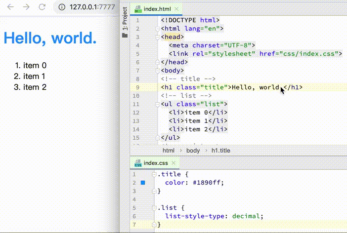

# gulp-memory-fs



`gulp-memory-fs`可以让开发者在使用gulp构建时也可以使用内存文件系统（[memory-fs](https://github.com/webpack/memory-fs)）。

## 开始使用

```javascript
const gulp = require('gulp');
const GulpMemoryFs = require('gulp-memory-fs');

const mfs = new GulpMemoryFs({
  dir: 'dist'
});

function build() {
  return gulp.src(path.join(__dirname, 'src/**/*.js'))
    .pipe(mfs.changed('dist'))
    .pipe(mfs.dest('dist'));
}

async function server() {
  await gulpMemoryFs.createServer();
}

function watch() {
  gulp.watch('src/**/*.js', js);
}

exports.default = gulp.series(
  build,
  gulp.parallel(watch, server)
);
```

打开浏览器，输入`http://127.0.0.1:7777/`，开始开发。

## API

### GulpMemoryFs

| 参数 | 类型 |  说明 | 默认值 |
| --- | --- | --- | --- |
| port | number | 服务的端口号 | 7777 |
| dir | string | 资源的目录 | &nbsp; |
| reload | boolean | 文件保存时，浏览器是否刷新 | false |
| https | { key: string; cert: string; } | 配置https证书，服务启用https | &nbsp; |

### GulpMemoryFs.prototype.changed & GulpMemoryFs.prototype.dest

由于是内存文件系统，无法使用`gulp-changed`，使用`GulpMemoryFs.prototype.changed`来只编译修改后的文件。

| 参数 | 类型 |  说明 |
| --- | --- | --- | --- |
| output | string | 输出文件的目录 |